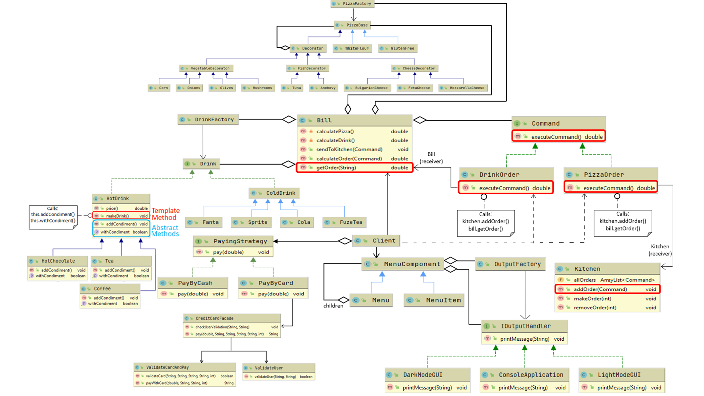

# Design-Patterns-Project-Pizzeria
This project shows the use of many DP in order to create clean, reusable and easily maintained code.

The project focuses on the idea of creating an end-to-end order management system for a pizzeria.
The tagert audience are waiters who work in the pizzeria and need to provide service to the customers.

The system will allow the user to choose a dish from the menu - pizza with toppings and cold/hot drink.

3 Things will happen then:

- The dish price is calculated.
- The customer will choose a payment method- cash or credit card. If credit card is chosen we will connect to the bank's system that validates the user's details.
- The order will be sent to the kitchen.

# Design Patterns

## 1. Composite
For the pizzeria's menu.

## 2. Command
- Sending the order to the kitchen.
- Calculating the order's price.

## 3. Factory
Creating the pizza and creating the drinks.

## 4. Decorator
Creating the chosen toppings on the pizza.

## 5. Template Method
Letting the customer choose a condiment for a hot drink.
Each hot drink offers a different condiment (Tea- lemon, Coffee- milk, Hot Chocolate- cream).

## 6. Strategy
Letting the customer choose his preferable payment method- cash or credit card.

## 7. Façade
If credit card is chosen, we will communcicate with the Façade of the bank in order to validate the user's details.

## 8. OutputHandler
Using Strategy and Factory design patterns we created an easy way to choose between different GUI implementations.

## UML

## Use Case Diagram

